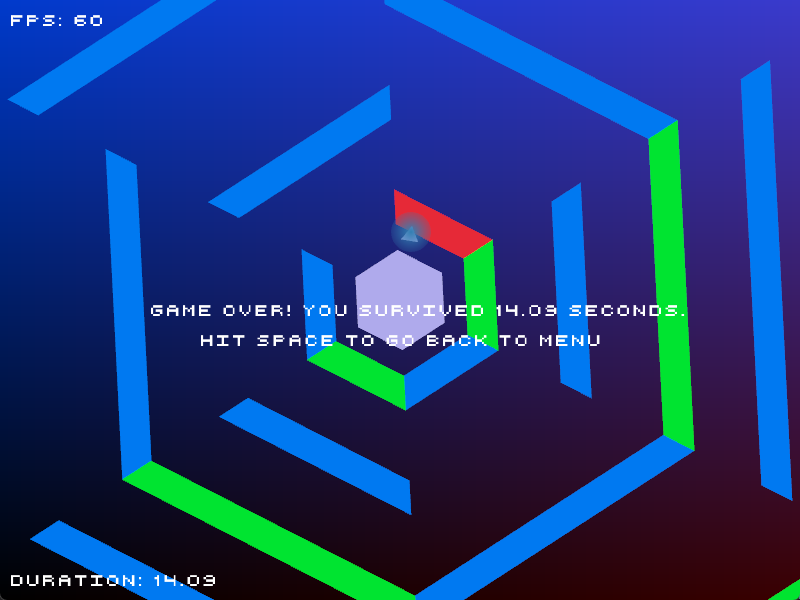

## Hex Game

<!--  -->

This is a basic arcade game inspired by Super Hexagon.

The objective is to survive for as long as possible.

Blue walls need to be avoided by the triangle moving in the center,
and Green walls need to be avoided by the cursor.

This game is written entirely in C++, using the raylib library for
graphics handling and some basic vector math.

The primary objective of this project was to learn about some basic
game design concepts that are taken for granted when using higher level
game engines, like relative rotation, window scale matching, 
and collision detection.

### To-do
- get music
- sync wall maps to music
- come up with more creative wall patterns

### Acknowledgements
- Beeping sounds are taken from Freesound.org, from user Pan14.
- Font is provided by Dafont.com, from user Petyka.